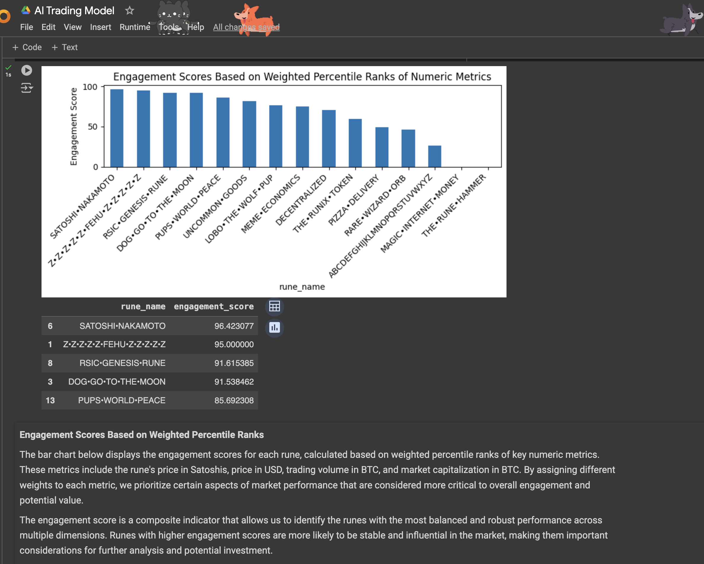
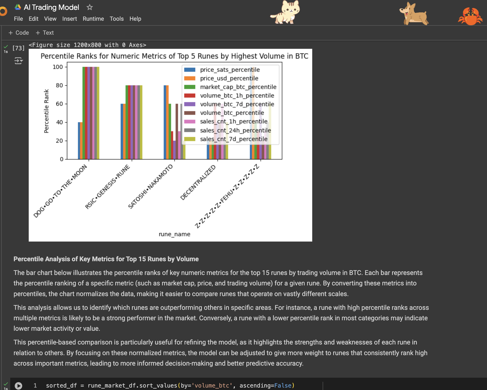
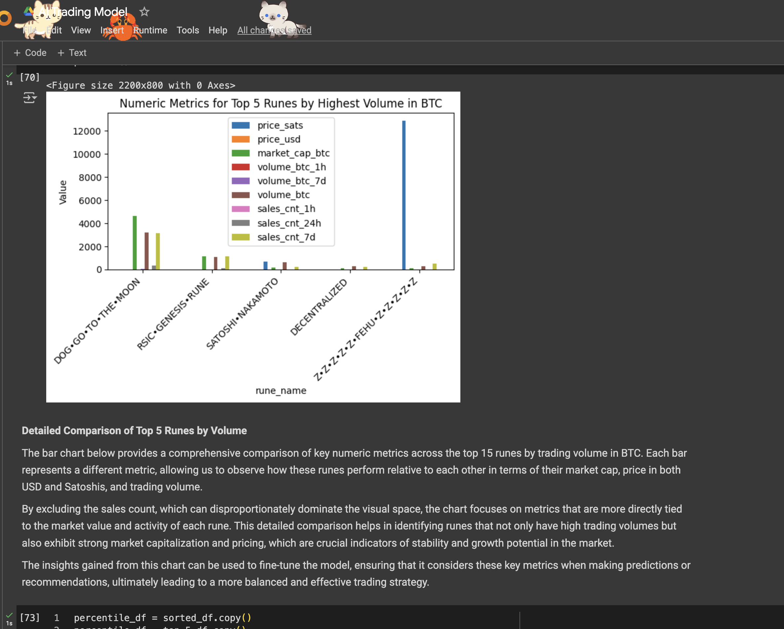
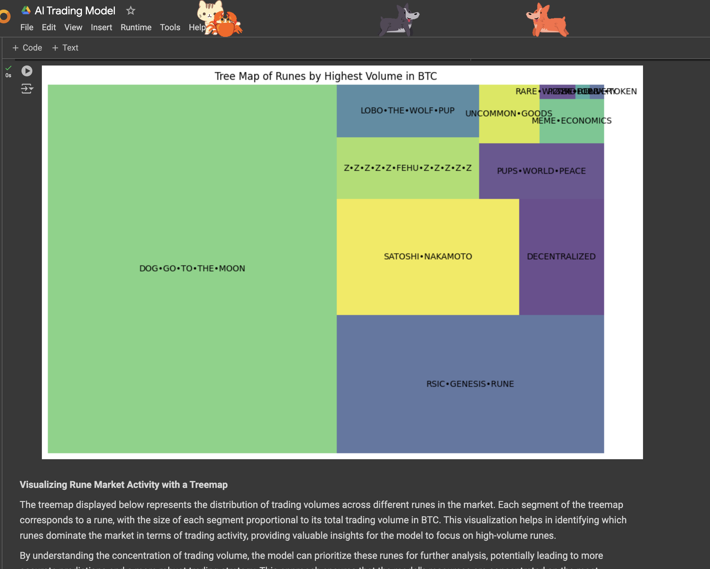

# AI Trading Model Analysis

## Overview

The AI Trading Model is designed to predict and assess the potential of various runes in the cryptocurrency market based on several key metrics. The model employs a combination of weighted percentile ranks to calculate an engagement score for each rune, providing a comprehensive view of their market performance. This document details the methodology and the insights generated from the analysis.

## Methodology

### 1. **Data Collection and Preprocessing**
   - The model first gathers data on various runes, including metrics like price in Satoshis and USD, trading volume in BTC across different time frames, and market capitalization.
   - Data is then preprocessed, ensuring that all numeric fields are converted to a suitable format and any non-numeric data is handled appropriately.

### 2. **Percentile Ranking**
   - Each numeric metric is converted into a percentile rank, allowing for a normalized comparison between different runes. This step is crucial for ensuring that the model can compare metrics that may operate on vastly different scales.

### 3. **Weighted Engagement Score Calculation**
   - A base value of `10` is assigned to each rune's engagement score.
   - The engagement score is then calculated by adding weighted contributions from the following metrics:
     - Price in Satoshis
     - Price in USD
     - Trading volume in BTC
     - Market capitalization in BTC
   - Weights are assigned to each metric based on their perceived importance, with higher weights given to metrics like trading volume and market cap, which are strong indicators of a rune's market presence.

### 4. **Visualization**
   - **Engagement Scores Bar Chart**: Displays the total engagement scores for each rune, providing a quick comparison of their market potential.

   - **Stacked Bar Chart with Contribution Breakdown**: Each rune's engagement score is broken down into its constituent parts, showing how much each metric contributed to the overall score.

   - **Percentile Ranks for Key Metrics**: A comparison of the top runes' performance across various metrics, normalized into percentile ranks.

   - **Tree Map of Runes by Volume**: A visual representation of the trading volume for each rune, helping to identify which runes dominate the market.

## Insights

### 1. **Engagement Scores**
   - The engagement scores help identify runes that are consistently strong across multiple dimensions of market performance. Runes with higher scores are more likely to be stable and influential in the market.

### 2. **Metric Contributions**
   - By breaking down the engagement score into its contributing factors, the model can highlight which metrics are driving a rune's success. For example, a rune with a high trading volume but low price might indicate a high level of market activity without significant value appreciation.

### 3. **Market Dominance**
   - The tree map provides a clear picture of which runes have the highest trading volumes, offering valuable insights into where the market's attention is focused.

## Conclusion

The AI Trading Model leverages a combination of percentile ranks and weighted scores to provide a nuanced view of the cryptocurrency market. By focusing on key metrics and normalizing the data for comparison, the model can predict which runes are likely to perform well and offer valuable insights for potential investment strategies.

This analysis forms the foundation for a robust trading algorithm that can adapt to different market conditions, prioritize high-potential assets, and ultimately improve decision-making in the volatile world of cryptocurrency trading.
